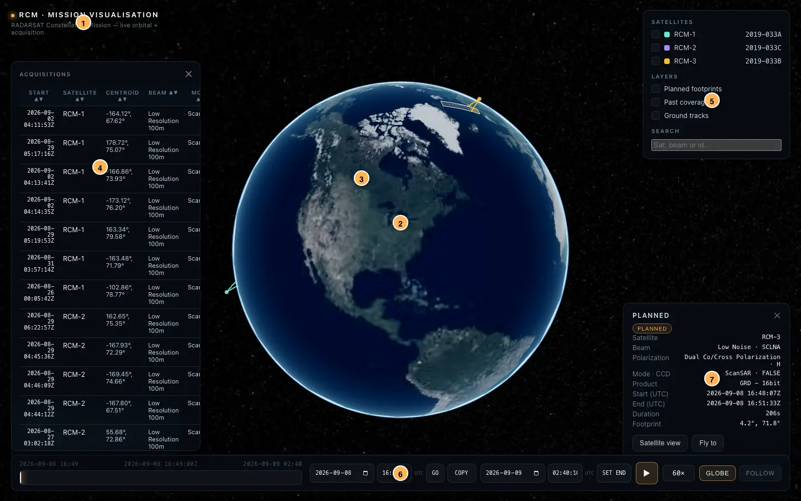
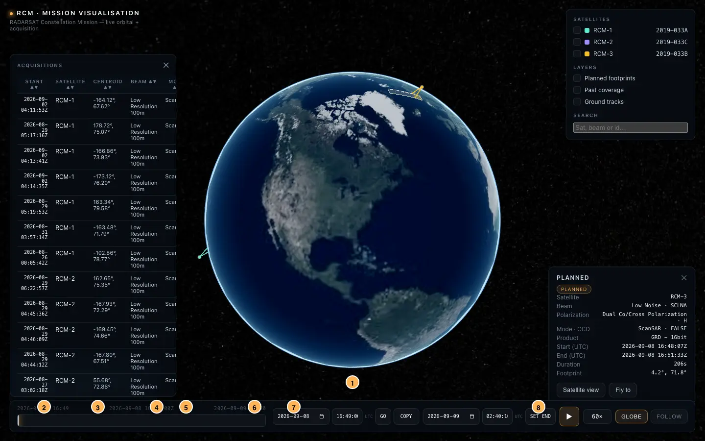
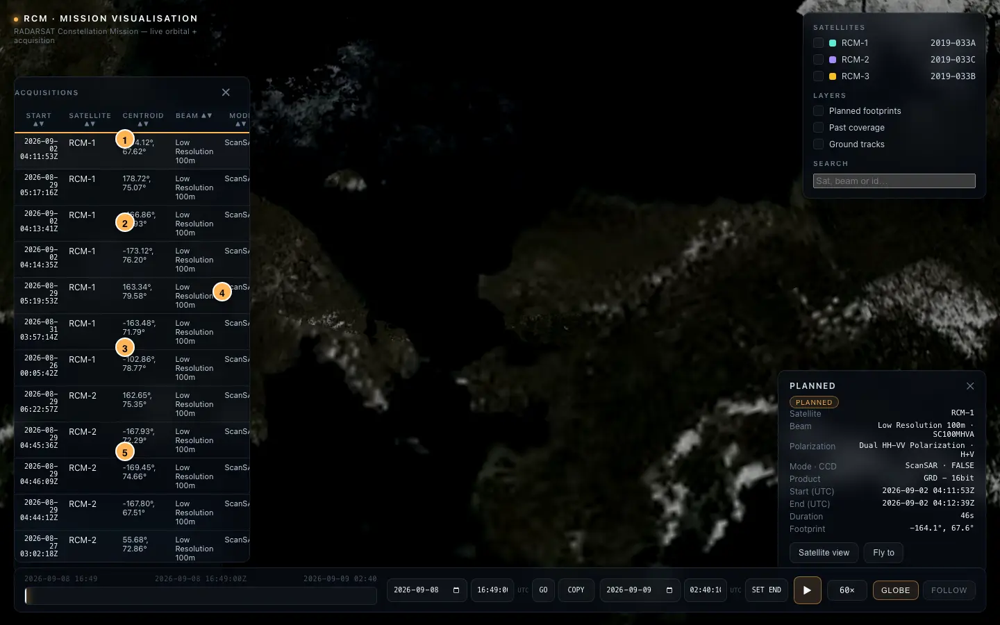
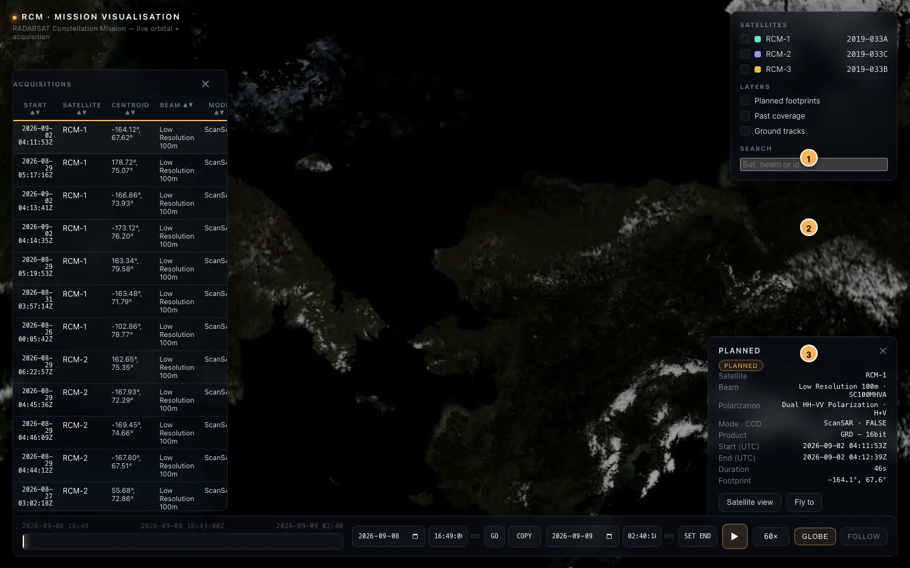
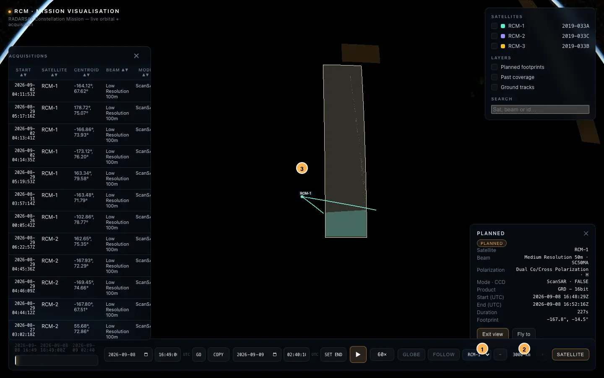
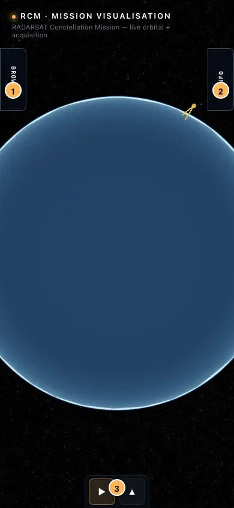
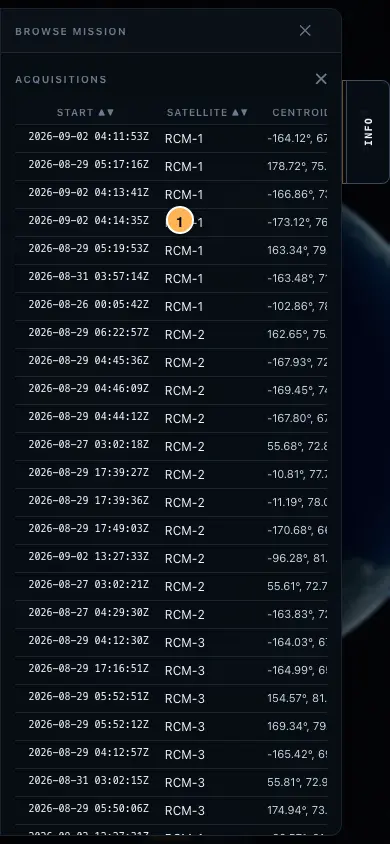
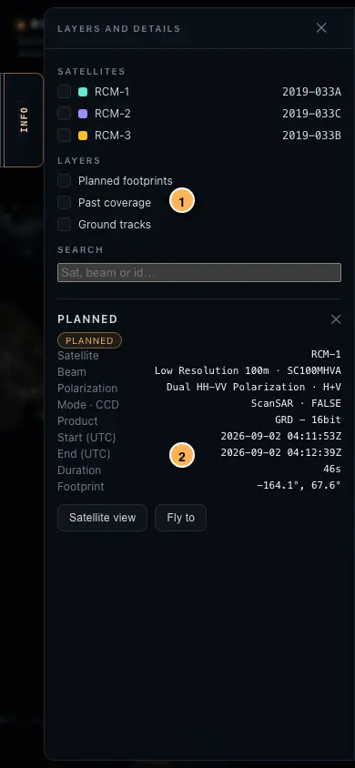
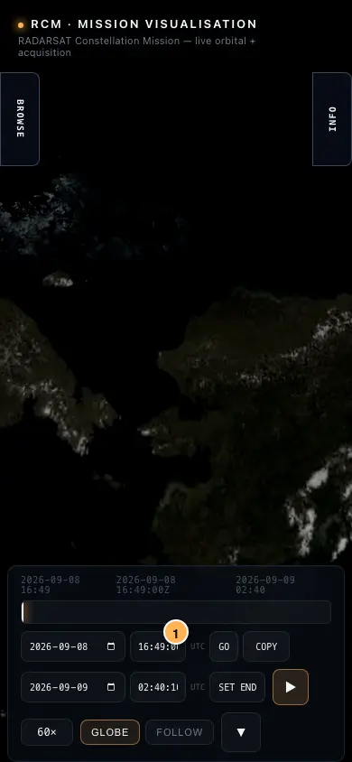

# RCM Visualisation — User Guide

A hands-on guide to the RADARSAT Constellation Mission (RCM) 3D visualisation. The app shows the three RCM satellites (RCM-1, RCM-2, RCM-3) orbiting Earth with their planned imaging footprints, live acquisition sweeps (including simultaneous multi-satellite sweeps), and overview/follow/satellite camera views.

> **Tip:** Images below use numbered callouts. The number in the screenshot matches the numbered list underneath it.

---

## 1. Desktop Overview



| # | Element | What it does |
|---|---------|--------------|
| ① | **Header** | Mission title — always visible, never blocks interaction. |
| ② | **Globe / Satellites** | Cesium globe with RCM-1 (teal), RCM-2 (violet), RCM-3 (amber) plus 15-minute trails. Click a satellite point/label to select it. |
| ③ | **Acquisition footprints** | Orange outlines = planned (next 48 h + last 3 h). Bright cream = selected. Small green dots = recent completed coverage. Coloured bands + beams = live SAR sweeps. |
| ④ | **Left — Acquisitions browser** | Searchable, sortable table of planned acquisitions. Click **Select** to fly to and highlight a footprint. |
| ⑤ | **Right — Layers & Search** | Toggle satellites, planned footprints, past coverage, and ground tracks; quick search by id/satellite/beam. |
| ⑥ | **Bottom — Timeline** | Playback controls, UTC time, speed, camera modes, and satellite-view controls (detailed below). |
| ⑦ | **Cards** | Selected acquisition or satellite details appear here with **Fly to** / **Follow** / **Satellite view** actions. |

---

## 2. Playback, Seeking, and Sharing



| # | Control | How to use |
|---|---------|------------|
| ① | **Scrub bar** | Click anywhere on the track to jump to that time. The thin bright line is the playhead. |
| ② | **Date (`YYYY-MM-DD`)** | Native calendar picker — UTC. |
| ③ | **Time (`HH:mm:ss` 24-hour)** | Type `14:30:05`-style 24-hour time. `00`–`23` hours, `00`–`59` minutes/seconds. Invalid values block submit. |
| ④ | **Go** | Seeks to the combined date + time. Clamps to the mission window (`[startMs, endMs]` from `planned.json` and any `?start`/`?end` bounds) and updates the URL `?start` via `history.replaceState`. |
| ⑤ | **End date + End time — Set end** | Second `YYYY-MM-DD` + `HH:mm:ss` pair that bounds playback. **Set end** updates the mission window to `[startMs, newEndMs]` and writes `?end` to the URL. `newEnd` clamps to `>= startMs` and to the dataset window; `end < start` is clamped to `start`. Used together with `?start` to share a bounded window. |
| ⑥ | **Copy** | Copies a full shareable link for the *currently displayed* mission time plus the active window (`?start` + `?end`). Shows **Copied** for ~1.8 s or **Retry** on failure. Paste into email/notes — recipients open at the same moment and window. Falls back to `execCommand('copy')` when `navigator.clipboard` is unavailable. |
| ⑦ | **Play / Pause (▶/⏸)** | Toggles `viewer.clock.shouldAnimate`. Works after any seek, including URL `?start=`/`?end` deep links. |
| ⑧ | **Speed** | Cycles `1× → 10× → 60× → 300× → 1200×` (also via `ctrl.setSpeed`). |
| ⑨ | **Camera** | `Globe` (overview) / `Follow` (requires selected satellite) / `Satellite` (wide trailing view) — see §5. |

**URL deep link:**
```
https://your-host/?start=2026-09-08T16:49:00Z
https://your-host/?start=2026-09-08T16:49:00Z&end=2026-09-09T00:00:00Z
https://your-host/?start=2026-09-08T16:49:00Z&end=2026-09-09T00:00:00Z&rcm=noglobe#scene
```
Zone-less values are treated as UTC; offsets like `2026-09-08T12:49:00-04:00` are respected; out-of-window values clamp to the nearest boundary; `end` before `start` clamps to `start`. `start` defaults to `manifest.clockSeedMs` (or window start), `end` defaults to `win.endMs`.

---

## 3. Finding an Acquisition



| # | Feature | Details |
|---|---------|---------|
| ① | **Search** | Filters by id, satellite (`RCM-2`), or beam name. |
| ② | **Sort** | Click `Start`, `Satellite`, `Centroid`, etc. toggles `asc/desc`. |
| ③ | **Rows** | Show UTC start, satellite, centroid, beam, mode, product. Highlighted row = `selectedAcq`. |
| ④ | **Select** | Pauses playback, exits driven cameras, seeks to the acquisition start, and frames the footprint at ~3 000 km altitude (`controller.navigateToAcquisition`). The footprint is pinned even if outside the rolling `[now-3h, now+48h]` window. |
| ⑤ | **Pagination** | 50 rows per page. |

You can also click any orange footprint directly on the globe to select it.

---

## 4. Reading the Detail Cards



The **acquisition card** shows: satellite, beam + beam ID, polarization, mode/CCD, product, UTC start/end/duration, centroid, and three actions:

- **Satellite view** — enters the schematic trailing view behind that satellite (see §5). Unavailable if the acquisition footprint cannot be located.
- **Fly to** — centres the overview camera on the footprint centroid.
- **Exit view** (when already in satellite view) — returns to overview.

The **satellite card** (opened by clicking a satellite point/label) shows NORAD id, international designator, inclination, and TLE epoch with **Follow** and **Fly to** buttons.

> **New:** Clicking a satellite on the globe now selects it — this wires up the **Follow** button (§5).

---

## 5. Camera Modes



| Mode | How to enter | What you get |
|------|--------------|--------------|
| **Globe (Overview)** | **Globe** button or `Esc` from satellite view. | Free globe camera. Selecting an acquisition recentres on its centroid. |
| **Follow** | Select a satellite (click its point/label) → **Follow** (in the satellite card) or the timeline **Follow** button (requires `selectedSat`). | Camera tracks the satellite's ECEF position via `SampledPositionProperty` at the current clock time. |
| **Satellite view** | Select an acquisition → **Satellite view**, or pick a satellite-view-compatible acquisition; on phones the **Info** drawer holds these controls. | Schematic wide trailing view ~3 000 km behind the satellite (default). Use the satellite dropdown to switch among RCM-1/2/3 without leaving the mode, and `−`/`+` to step height `500 → 3 000 km` in 500 km increments. Shows upcoming footprints for the viewed satellite over a 100-minute horizon. Schematic only — not a measured sensor footprint. |
| **Fly to** | **Fly to** on either card. | One-shot focus on the target; remains in `overview` mode. |

Orbit comes from SGP4 propagation on a 30 s grid over the mission window (`GRID_STEP_MS`) plus a 15-minute trail (`TRAIL_MS`) and a 120 s ground-track line.

---

## 6. Layers and Visibility

In the right **Layers** panel:

- **Planned footprints** — orange polygons for `[now-3h, now+48h]`. Rolling window keeps entity count ~1.3 k. Selected footprints persist up to 3 h after their end before being culled.
- **Past coverage** — green point cloud (≤5 000 dots) at historical acquisition centroids.
- **Ground tracks** — faint geodetic lines sampled every 120 s along each orbit.
- **Satellite filter** — checkboxes per spacecraft; filters both the globe and the browser table.

Additional toggles: the same panel exposes per-satellite checkboxes that dim layers without hiding the entire timeline.

---

## 7. Simultaneous Collections

The app animates **all** active acquisitions at once. If RCM-1 and RCM-2 both collect in the same minute, you see two coloured sweep bands filling at their own rates plus two beams from each spacecraft to its footprint's leading edge. The selected/highlighted acquisition is the one whose midpoint is closest to the current time (or to the viewed satellite in satellite view), but the other sweep remains visible. Previously only one sweep was shown.

**Good example** (in the bundled dataset):
```
?start=2026-09-08T16:49:00Z  — RCM-1 + RCM-3, ~3 min overlap
?start=2026-08-31T07:51:00Z  — RCM-2 + RCM-3, ~2.5 min overlap
```

---

## 8. On iPhone

### Collapsed (default)



| # | Element |
|---|---------|
| ① | **Browse** handle (left, vertical, 44 × 104 px) — taps to show the acquisitions table + diagnostics (88 vw). |
| ② | **Info** handle (right) — layers + detail cards. |
| ③ | **Bottom dock** (centred, 108 × 55 px, at the safe-area bottom) — only **Play** + **▲** when collapsed, so the globe fills ~95 % of the height. |

Drawers start collapsed so the animation is immediately visible. Tapping a satellite or footprint does *not* auto-open the drawer.

### Browsing



The acquisitions table is 720 px wide and scrolls horizontally inside the drawer. Pagination stays at the bottom. The drawer is `88vw + 44px` wide, centred vertically with `8px` safe-area insets, and scrolls internally (`overscroll-behavior: contain`).

### Details



Shows the same layers/search plus whichever card is active. Dismiss with the **✕** in the drawer header, the dimmed **scrim**, or **Esc**. Only one drawer opens at a time.

### Full Timeline



Tap **▲** in the bottom dock to expand. The timeline slides up from beyond the viewport to the safe-area bottom (`max(0px, env(safe-area-inset-bottom))`). Hide it again with **▼** to reclaim ~121 px of globe height on a `390×844` iPhone. Desktop keeps the full timeline permanently visible at `left/right 20px, bottom 18px`.

---

## 9. Tips & Troubleshooting

- **Time not moving?** Press **▶** — deep links and seeks land paused.
- **“Mission data not found”?** Run `npm run data` then `npm run dev`.
- **Performance on older phones** — hide **Past coverage** and **Ground tracks**.
- **Imagery not loading** — the Blue Marble texture is optional; `?rcm=noglobe` forces a dark globe.
- **Link goes to wrong time** — `start`/`end` are clamped to `[manifest.window.startMs, manifest.window.endMs]`; `end < start` clamps to `start` (visible as the scrub-bar range). Verify both lie inside the dataset window.
- **End before start** — the timeline clamps `Set end` to `>= start`; the URL does the same on load.

---

Data dates shift whenever the ingest runs (`npm run data` or Cloudflare `npm run data && npm run build`). Screenshots use the bundled sample window; your dates will vary with fresh data but every control behaves identically.
